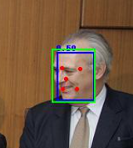
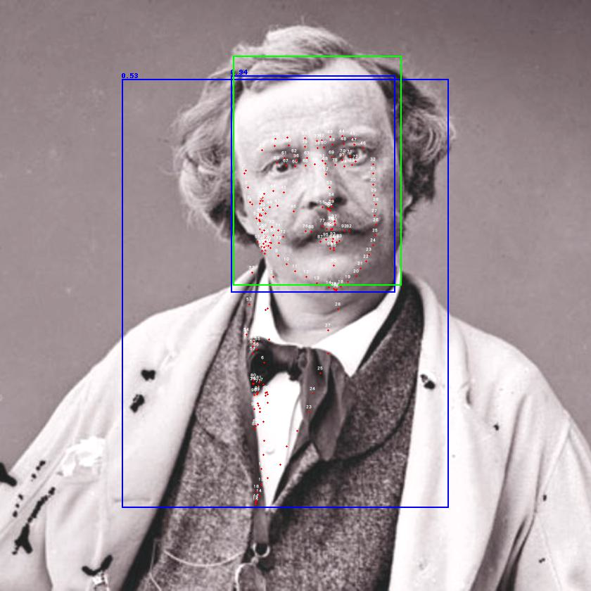
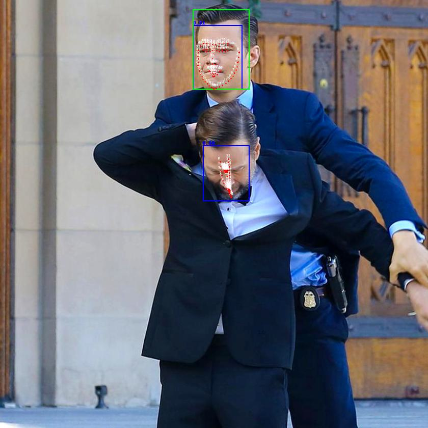
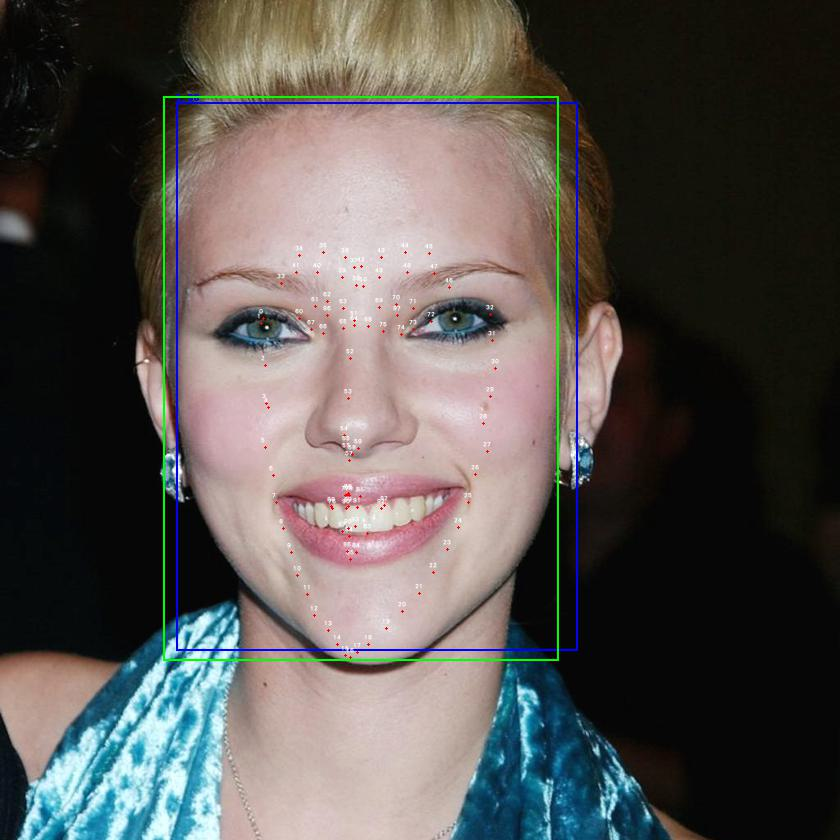

# Main Referenece

- https://github.com/biubug6/Pytorch_Retinaface

# Changes

- The original project only support facial landmarks of 10 points. Modification has been made to support an arbitrary number of points, setting can be found in `src.config.n_landmarks`.
- Network modification has been made before feeding features into different detection heads (`classes`, `bboxes`, `landmarks`, etc).
- Attention mechanism has been added by introducing Squeeze and Excitation Block (SEBlock) after each feature of different scales after `SSH`'s. It mainly learns which channels are relatively more important for different detection.
- The training is done using (**W**ider **F**acial **L**andmarks in the **W**ild) WFLW dataset.

# Dataset Check of WFLW

Each of the ground truths in WFLW look:

# Why WFLW Dataset?

I want the relative location of pupil for further study and WFLW is the one that also annotate pupil.

# Sample Result

## When Using Landmarks of 10 Points (Wider Face)

## When Using Landmarks of 98 Points (WFLW) with SEBlocks

Still training in progress, different hyper-parameters are still being investigated

At epoch 41:

- green box = ground truth
- blue box = predictions

Prediction threshold has be set to 0.1 only. Higher threshold can rule out inappropriate boxes.

